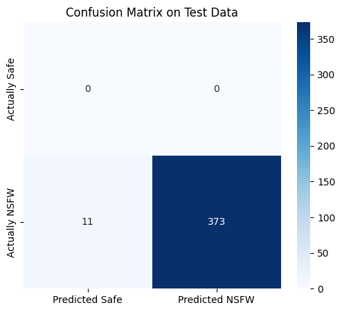
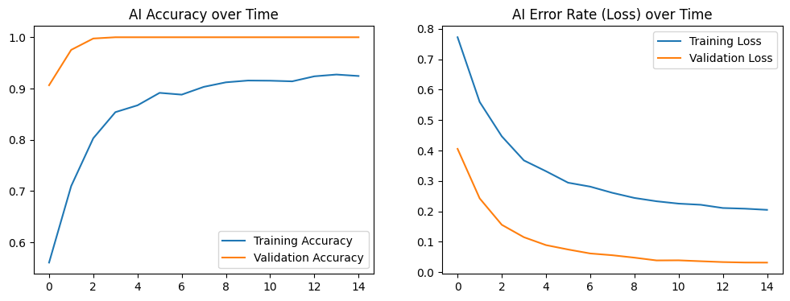

#  voidememo Vault

**The Private Digital Bibliotheca.** Access, organize, and protect your media with absolute privacy.




voidememo is an advanced, privacy-first media vault built with Python and Streamlit. It combines bank-grade security protocols with a local Deep Learning AI engine to manage, protect, and optimize your personal digital memories.

##  Core Features

 **Bank-Grade Security & Authentication:** Multi-factor authentication featuring Email OTPs, secure SHA-256 password hashing (with pepper), and PIN-protected albums with secure email recovery flows.
 **Local AI Content Moderation:** Integrates a native TensorFlow/Keras deep learning model (`Manager Engine`) that scans uploads locally and automatically blurs sensitive/NSFW content without relying on third-party APIs.
 **Lightning-Fast Media Delivery:** Utilizes dynamic Cloudinary transformations to serve highly compressed thumbnails in grid views, loading full-resolution files only when entering the full-screen Lightbox.
 **Deterministic Story Engine:** Automatically curates your media into dynamic, cache-optimized stories like *Recent Highlights*, *Memory Lane*, and *Favorites*.
 **Social & Sharing Ecosystem:** Share media batches securely with "Nearby Users" (matched by location PIN) or globally. Includes real-time in-app notifications, media preview overlays, and emoji reactions.
 **Developer API:** Generate secure, read-only REST API endpoints to directly embed your private albums into external portfolios, React/Next.js apps, or websites.
 **Smart Duplicate Removal:** One-click MD5 hashing utility to scan albums, find exact duplicate files, and automatically clean them up to save cloud storage.

## Technology Stack

* **Frontend & Framework:** [Streamlit](https://streamlit.io/) (Highly customized with raw HTML/CSS/JS injection for a native-app feel).
* **Database:** [MongoDB Atlas](https://www.mongodb.com/) (NoSQL document storage for users, folders, files, and notifications).
* **Media Storage:** [Cloudinary](https://cloudinary.com/) (Secure cloud blob storage and dynamic image transformation).
* **Artificial Intelligence:** [TensorFlow / Keras](https://www.tensorflow.org/) (Computer Vision).
* **Authentication:** Native SMTP integration (Google App Passwords) and cryptographic hashing.

##  Installation & Setup

### 1. Clone the Repository
```bash
git clone [https://github.com/yourusername/voidememo-vault.git](https://github.com/yourusername/voidememo-vault.git)
cd voidememo-vault
2. Install Dependencies

Ensure you have Python 3.9+ installed.

Bash
pip install -r requirements.txt
(Dependencies include: streamlit, pymongo, cloudinary, certifi, tensorflow, Pillow, numpy)

3. Environment Variables (Secrets)

Create a .streamlit folder in the root directory and add a secrets.toml file. Fill in your API keys:

Ini, TOML
# .streamlit/secrets.toml

# MongoDB Connection String
MONGO_URI = "mongodb+srv://<username>:<password>@cluster.mongodb.net/?retryWrites=true&w=majority"

# Cloudinary Credentials
CLOUDINARY_CLOUD_NAME = "your_cloud_name"
CLOUDINARY_API_KEY = "your_api_key"
CLOUDINARY_API_SECRET = "your_api_secret"

# Email SMTP for OTP & Notifications (Use a 16-letter Google App Password)
SMTP_EMAIL = "your-email@gmail.com"
SMTP_PASSWORD = "your_16_letter_app_password"

# Security Pepper for Password Hashing
APP_PEPPER = "a_super_secret_random_string"
4. Install the AI Model

The application requires the deep learning model to run. Ensure you place your Keras model file (new_custom_nsfw_model.keras) directly in the root directory.

Note: If you are using Git LFS for this file, ensure it is properly pulled and not just a text pointer.

5. Run the Application

Bash
streamlit run app.py
Project Structure
Plaintext
voidememo-vault/
│
├── app.py                         # Main application logic & UI
├── new_custom_nsfw_model.keras    # TensorFlow AI Moderation Model
├── requirements.txt               # Python dependencies
├── .streamlit/
│   └── secrets.toml               # Environment variables (Do not commit!)
└── README.md                      # Documentation
Privacy Policy & Data Architecture
voidememo is built on a zero-trust philosophy for external viewers.

Passwords & PINs: Never stored in plaintext. Hashed using SHA-256 with a secure pepper.

AI Processing: The AI model processes file byte streams in memory.

Media Deletion: Deleting an album or file triggers a hard deletion from both the MongoDB database and the Cloudinary storage bucket simultaneously.

License
© 2026 voidememo. All rights reserved.
(Update with your specific open-source license if you intend to make this public, e.g., MIT, GPL-3.0)